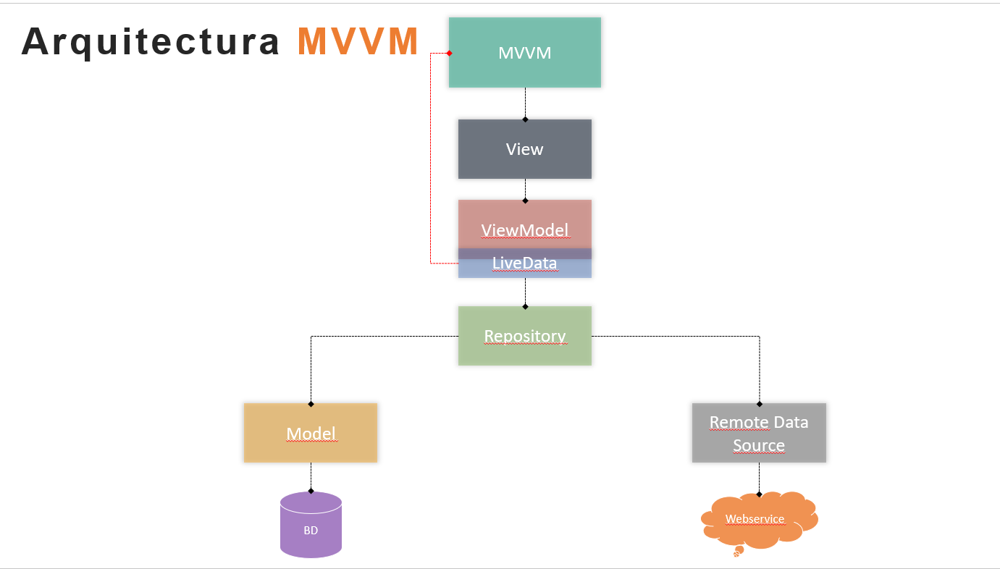
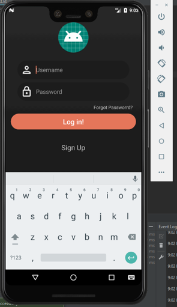
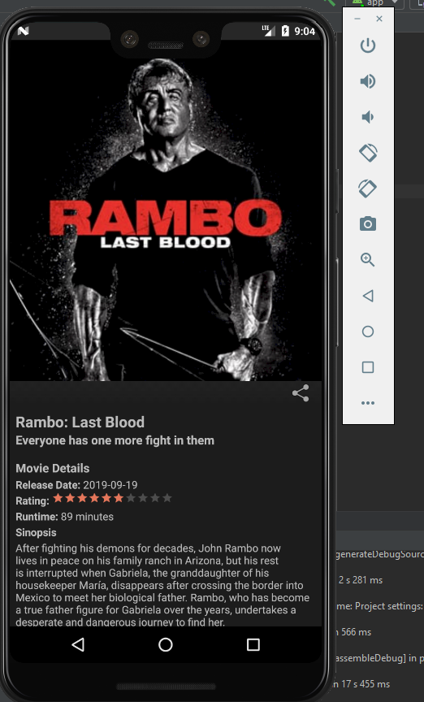
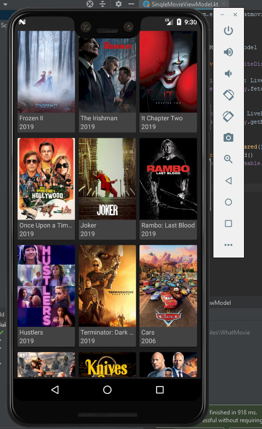
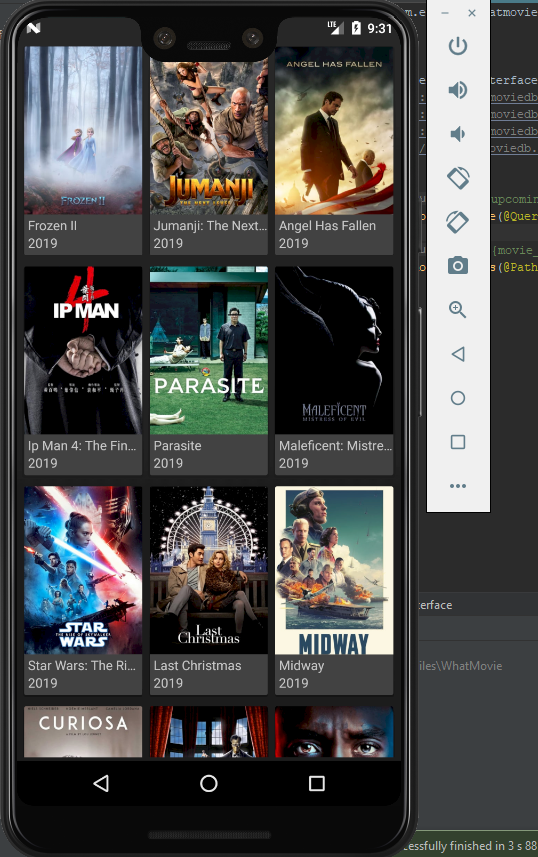

# DiplomadoKotlinApec

# Practica Final

Este repositorio corresponde al diplomado tomado en la MEECYT en APEC Republica Dominicana. Sera una serie de archivos sueltos pero con orden logico propio del curso.

MVVM es una arquitectura desarrollada por Microsoft alrededor de 2004, cuando también se creó Windows Presentation Foundation.

El modelo, al igual que en MVC, representa la capa de datos y/o lógica de negocio.
La vista presenta la información y es activa, reaccionando a cambios en el modelo, de forma similar a un patrón MVC activo.
El modelo de vista es un actor intermediario entre el modelo y la vista y contiene toda la lógica de presentación.

 

Pantallas de la app ==> What Movie?

      
      
## Tecnologias / Librerias usadas:
Kotlin
MVVM architectural pattern
Paging library for Pagination
RxJava
Retrofit
themoviedb.org REST API

## Autor

* **Melvin Medina** - *Initial work* -

## Creditos
https://oxcoding.com/tutorials/android-movie-app-using-mvvm-paging-library-rxjava-and-retrofit/lessons/android-movie-app-overview-intro-mvvm-paging-library-rxjava-retrofit/

## Licencia

Este projecto esta bajo la licencia MIT License - Para mas detalles [LICENSE.md](LICENSE.md)

